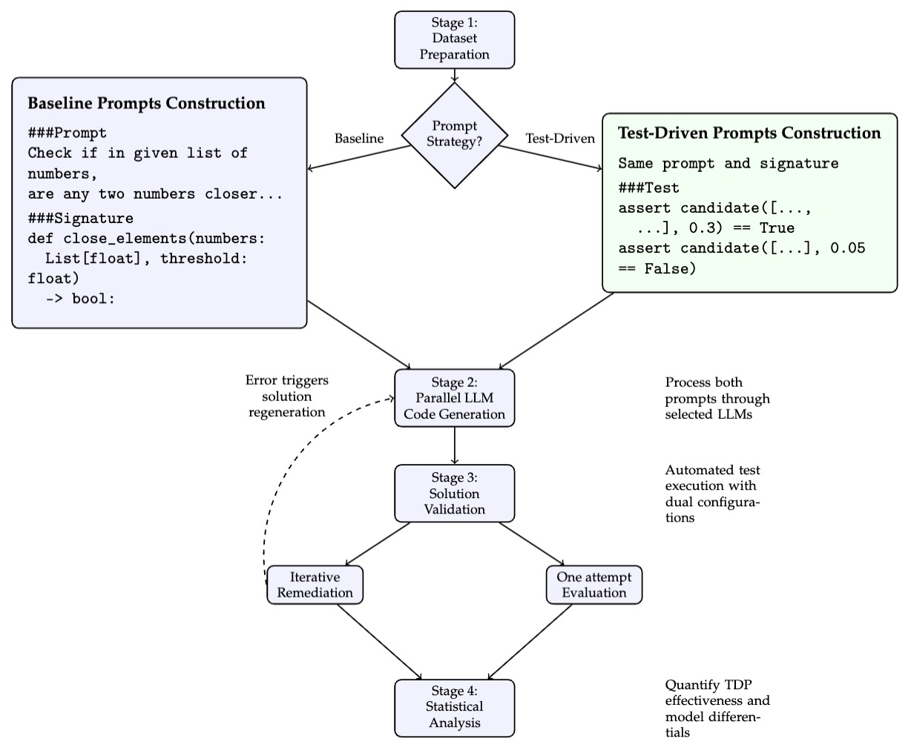

# Improving Code Generation with Large Language Models: A Multi-Model Empirical Study of Test-Driven Prompting Effectiveness

>
> **⚠️ For MDPI Applied Sciences Reviewers**
>
> Here are the examples mentioned in the paper:
>
> - Dataset Prompt Comparison: https://github.com/madnanrizqu/test-driven-prompting-multi-large-language-models/blob/main/datasets/prompt_comparison/prompt_comparison.pdf
> - RQ2 Qualitative Analysis: https://github.com/madnanrizqu/test-driven-prompting-multi-large-language-models/blob/main/results/rq2_qualitative_analysis/summary/summary.pdf

This repository contains the experimental data and analysis for a research study demonstrating how **Test-Driven Prompting (TDP)** significantly improves AI code generation across multiple programming languages and difficulty levels. All experimental data, statistical analysis, and qualitative comparisons are included.

## What is Test-Driven Prompting?

Instead of just asking an AI to write code, Test-Driven Prompting includes example test cases in the prompt. This helps the AI understand exactly what the code should do, similar to how human programmers use test-driven development.

## Key Findings

Our study tested 8 different AI models (GPT-4, Claude, Qwen) on 3 programming benchmarks and found:

- 🎯 **Universal Improvement**: TDP worked better in 100% of test cases (16/16 model-dataset combinations)
- 📈 **Significant Gains**: Average 7.74% improvement in code generation success rates, statistical results: 95% CI [6.30%, 9.18%], effect sizes (Cohen's d = 1.83) and significance testing (p < 0.0001)
- 🚀 **Efficiency Boost**: Smaller AI models with TDP can outperform larger models using normal prompts
- 💡 **Biggest Impact**: Most helpful for problems with unclear or implicit requirements

The findings suggest that including test cases in your prompts to AI coding assistants can significantly improve the quality of generated code, especially for complex or ambiguous programming tasks.

## Authors

**Muhammad Rizqullah** (mrizqullah@stu.kau.edu.sa) and **Emad Albassam** (ealbassam@kau.edu.sa)
Computer Science Department, King Abdulaziz University, Jeddah, Saudi Arabia

*Corresponding author: Muhammad Rizqullah. Any enquiries about the research should be directed to him.*

## Publication Status

This research is currently under review at [MDPI Applied Sciences](https://www.mdpi.com/journal/applsci), a Scopus Q2 and Web of Science SCIE Q2 journal with an Impact Factor of 2.5.

## Repository Structure

- `datasets/` - Programming problems and test cases from HumanEval, MBPP, and Code Contests
- `raw_results/` - Complete experimental results for each AI model and dataset combination
- `results/` - Statistical analysis and comparison reports
- `abstract/` - Academic paper abstract with statistical findings

## Source Code Availability

Source code used to generate code with large language models, test generated code with test cases, and collect and aggregate results will be provided by the authors upon request.  